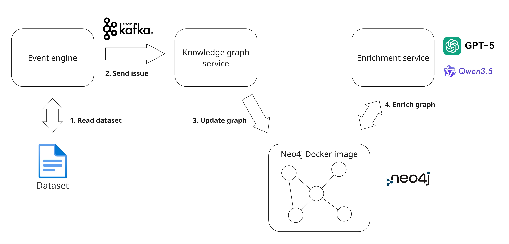

# Continuous Software Traceability Thesis

This branch is the simulation branch of the replication package of Rick van Grootveld his thesis. It contains the source code that has been used to produce the results in his thesis. You can run the program by having Python and Docker installed. 

## Project overview
Other branches in this replication package contain
- main
    - This branch contains the data analysis files, the ethics scan, metrics generation files, and what the project is about.
- scalability
    - This branch contains the scalability test of this study. Compared to the simulation branch, this branch contains an extra message protocol between the enrichment service and the knowledge graph service to control the input of the knowledge graph and thus the enrichment.
- prompt engineering
    - This branch contains the prompt engineering that has been done to end up with the prompt that has been used in the document.

### Current branch
This branch contains the source code of the code that has been used for the simulation. It has three services, the enrichment service, event engine service, and knowledge graph service.
Architecture: 



The event engine reads the dataset. It turns the records it reads from the dataset into nodes and edges according to a schema and sends them as events (issues and commits packages including also information about developers and code files) to the knowledge graph engine via Kafka. 

The knowledge graph engine receives those messages and inserts them into the Neo4j knowledge graph, which is a docker container that runs. The KG service does also add the embeddings by using the very light semantic embedding model all-MiniLM-L6-v2. 

The enrichment service does only talk with the Neo4j knowledge graph and not with the other services. It checks every second whether there have been a new incoming node or updated nodes. It receives the node if it is new, and a fixed window opens. This fixed window waits for 15 seconds (can be adjusted and depends on the model in the experiment) and checks if other events are being inserted into the graph (they might relate to each other). When it the time is over, the window is made empty before starting the retrieval of more relevant nodes. This allows to enrichment to also consider the events to enrich as the LLM is taken a long time. Then, the event engine goes to the following step of retrieving the context of the graph. This next retrieval step is to find the directly related neighbourhood nodes. These related nodes give more context about the node itself, making the LLM knowledgable of the surrounding nodes when the context of a node is minimal. Then, similar nodes from the window nodes are being retrieved. This is done using the vector similarity function provided by the Neo4j database. When all of the relevant nodes are being retrieved, the graph is fed to the LLM using a prompt. When the LLM responses, a function is applied to check the response on valid edges. This prevents the response from being invalid when there is only one special character that is missing to make it a valid response. Then the edges are inserted into the graph and the LLM starts over again. It depends on the duration it took for the next moment to enrich. If a new node was detected, during the enrichment and the window time has passed, the enrichment will enrich immediatly. However, if nothing has been detected, the enrichment service will wait till a new node is being inserted into the Neo4j database.


## Run the program
To run the program and to replicating the research:

The branch has been set to the settings of using the Qwen model.To use the GPT API, you should have a OpenAI API key to run the GPT model and you should change the global variables in the llm.py file in the enrichment folder to set it to GPT. If you don't have the API key, you can still build the Qwen model using the following steps.

Another prerequisite is the dataset. The dataset has been modified and should be saved at datasets/validate/lucene.sqlite3. The modifications contain more tables to easy data lookups for the event engine. 
Furthermore, the simulation runs from release of 6.0.1 till 6.1.0. To give the LLM context, a part of the graph should be given. Therefore, I used .dump files. They allow the neo4j container to load all the data back in. The preload data should contain all the commits from release 4.0.0 till the release time of 6.1.0. The release day has been set at 00.00 at the start of the release day. After downloading Docker and Python, I used the following constraints for Docker to stabalize the environment. When the program starts without any constraints, Docker and Windows start fighting for resources, causing the program to crash. Therefore, you should add the file .wslconfig to your path: "C:\Users\/user_name\.wslconfig". Save this file with the following content.
the file .wslconfig to your path: "C:\Users\/<user>\.wslconfig"
```
content: [wsl2] 
memory=12GB 
cores=6 
localhostForwarding=true
```

I chose the processers to be 6 because I have 16 processors in total and six allow a lower amount of communication, which allows a more steady state.

2. Then, open the terminal and navigate to the root folder of this project, use the following commands in your terminal to run the program in Docker:
```
//docker-compose build --no-cache

//docker exec -it ollama ollama pull qwen3.5:4b

docker-compose up --build -d
```
This builds the program first, downloads Qwen3.5 4B, and starts the program detached from the terminal. Downloading the model first prevents it from downloading when the program starts, which would run the program without enrichments for 10 minutes.

3. When the program starts, simultanuously run the docker_performance.py file. This file gathers information about the CPU and memory.

## Contact information
If there are any questions, please reach out to me.

GitHub username: RickvGrootveld