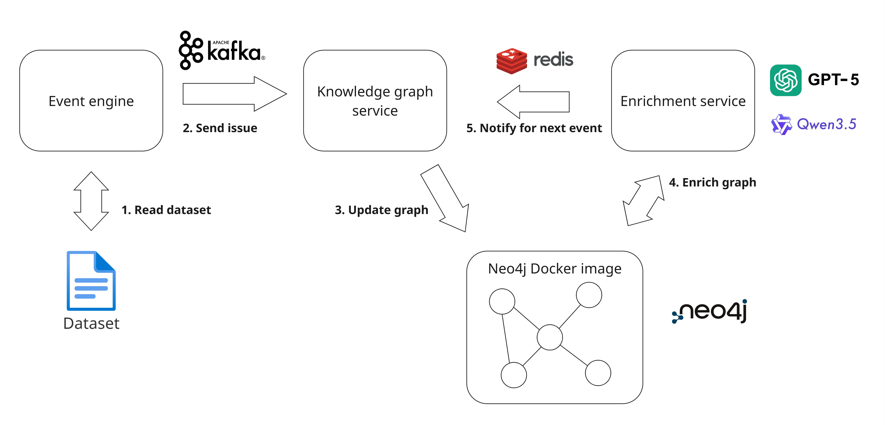

# Continuous Software Traceability Thesis

This branch is the scalability branch of the replication package of Rick van Grootveld his thesis. It contains the source code for the scalability tests. The program can easily be ran by having Python and Docker installed. The scalability contains a Redis messagner between the enrichment and the knowledge graph. This ensures more control over the input, which improves data analysis because the conditions are known and can therefore be explained. Scalability has the milestones of 0-184 nodes in the graph (first 10 events in the project), 1000 nodes, 5000 nodes, and 10000 nodes. All of them have preloaded data of all the events that have happened before. When the 1000 nodes milstone starts, the neo4j_1000_run_preload_data.dump file is being loaded as neo4j volume. This allows context for the LLM and to work with the amount of nodes in the graph. Each milestone runs the first 10 records to minimize bias of enriching a big event where a lot is being inserted, or a small event where nothing happens. This is done with all of the milestones to see the effect of scalability.

## Project overview
Other branches in this replication package contain
- main
    - This branch contains the data analysis files, the ethics scan, metrics generation files, and what the project is about.
- simulation
    - This branch contains the simulation part of the study. The simulation branch simulates the continuous stream of events into the knowledge graph. The enrichment constantly tries to enrich this knowledge graph. The results obtained from these simulations have been used in the survey.
- prompt engineering
    - This branch contains the prompt engineering that has been done to end up with the prompt that has been used in the document.


### Current branch
This branch contains the source code of the code that has been used for the scalability evaluation. It has three services, the enrichment service, event engine service, and knowledge graph service.
Architecture: 



The event engine reads the dataset. It turns the records it reads from the dataset into nodes and edges according to a schema and sends them as events (issues and commits packages including also information about developers and code files) to the knowledge graph engine via Kafka. 

The knowledge graph engine receives those messages and inserts them into the Neo4j knowledge graph, which is a docker container that runs. However, the insertion into the Neo4j graph only happens one-by-one when the enrichment services agrees to do so. Therefore, it listens to the Enrichment service via Redis whether to start inserting a new event into the knowledge graph that has been given by the event engine. This allows control over the insertion for research purposes. The KG service does also add the embeddings by using the very light semantic embedding model all-MiniLM-L6-v2.

The enrichment service detects new activities in the Neo4j knowledge graph and sends a message after the enrichment to the KG service to insert a new node into Neo4j. For the detection of new activities, it checks every second whether there have been a new incoming node by using the timestamp given to the nodes at moment of insertion into the graph. It receives the node if it is new to open a fixed window. This fixed window waits for 15 seconds (can be adjusted and depends on the model in the experiment) and checks if other events are being inserted into the graph (they might relate to each other). When it the time is over, the window is made empty before starting the retrieval of more relevant nodes. This allows to enrichment to also consider the events to enrich as the LLM is taken a long time. Then, the event engine goes to the following step of retrieving the context of the graph. This next retrieval step is to find the directly related neighbourhood nodes. These related nodes give more context about the node itself, making the LLM knowledgable of the surrounding nodes when the context of a node is minimal. Then, similar nodes from the window nodes are being retrieved. This is done using the vector similarity function provided by the Neo4j database. When all of the relevant nodes are being retrieved, the graph is fed to the LLM using a prompt. When the LLM responses, a function is applied to check the response on valid edges. This prevents the response from being invalid when there is only one special character that is missing to make it a valid response. Then the edges are inserted into the graph and the LLM sends a message to the KG service to say that the next event can be inserted. The enrichment service checks every minute again to see whether a new node has been inserted into the graph.

## Run the program
To run the program and replicating the research:

The branch has been set to the settings of using the Qwen model.To use the GPT API, you should have a OpenAI API key to run the GPT model and you should change the global variables in the llm.py file in the enrichment folder to set it to GPT. If you don't have the API key, you can still build the Qwen model using the following steps.


Another prerequisite is the dataset. The dataset has been modified and should be saved at datasets/validate/lucene.sqlite3. The modifications contain more tables to easy data lookups for the event engine. 
Furthermore, the scalability runs 10 events every milestone(0-184, 1000, 5000, and 10000 graph nodes) Therefore, I used .dump files. They allow the neo4j container to preload all the data. The preload data should contain all the commits before that milestone.

1. After downloading Docker and Python, I used the following constraints for Docker to stabalize the environment. When the program starts without any constraints, Docker and Windows start fighting for resources, causing the program to crash. Therefore, you should add the file .wslconfig to your path: "C:\Users\/user_name\.wslconfig". Save this file with the following content.
```
[wsl2]
memory=12GB
processors=8
localhostForwarding=true
```

I chose the processers to be 8 because I have 16 processors in total. Make sure that the constraints you save align with the requirements of your hardware. 

2. Then, open the terminal and navigate to the root folder of this project, use the following commands in your terminal to run the program in Docker:
```
//docker-compose build --no-cache

//docker exec -it ollama ollama pull qwen3.5:4b

docker-compose up --build -d
```
This builds the program first, downloads Qwen3.5 4B, and starts the program detached from the terminal. Downloading the model first prevents it from downloading the model at the start, which would run the program without enrichments for 10 minutes.

3. When the program starts, simultanuously run the docker_performance.py file. This file gathers information about the CPU and memory.

## Contact information
If there are any questions, please reach out to me.

GitHub username: RickvGrootveld